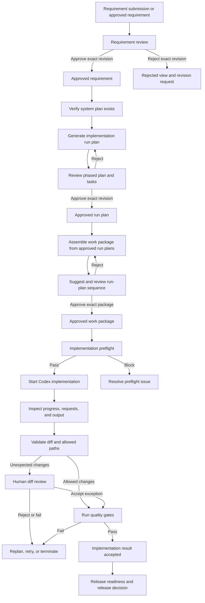
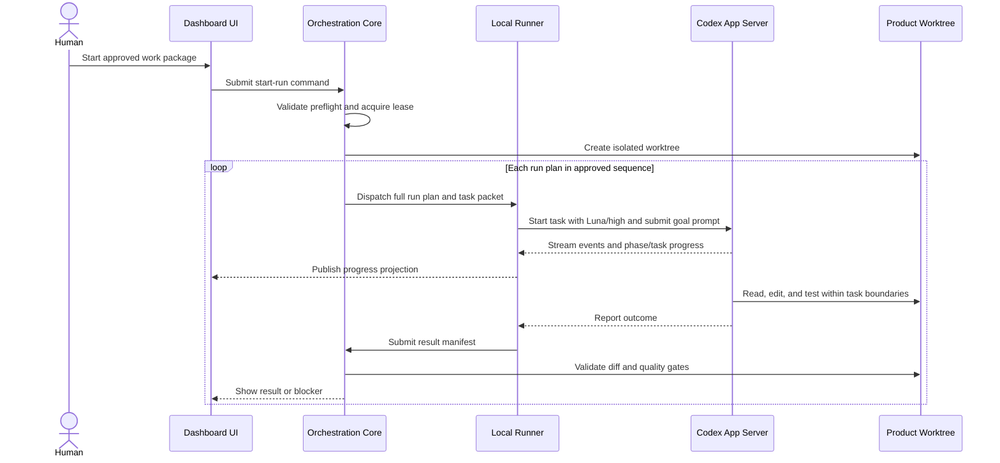

# Delivery Dashboard Design

## Status

Proposed design for the first usable local dashboard.

## Purpose

The delivery dashboard is the human control surface for moving approved Odoo requirements through planning, implementation, validation, and release. It reads durable artifacts from the configured customer delivery repository, presents derived workflow state, and submits constrained commands and approval decisions to the orchestration core.

The dashboard is not the authoritative store. Durable requirements, plans, approvals, workflow events, evidence, and releases remain in the customer delivery repository. High-frequency execution state, logs, process identifiers, and leases remain in the ignored local runtime store.

## Initial operating assumptions

- The first deployment is local and low-volume.
- One orchestrator owns a run at a time.
- The system plan is relatively static. The MVP verifies that a valid system plan exists but does not require a separate system-plan approval.
- Three human approval gates are required:
  1. Requirement revision approval.
  2. Implementation run-plan approval.
  3. Work-package membership and sequencing approval.
- Approval and rejection actions create immutable records through the orchestration core.
- Rejected source artifacts remain in their original locations. The dashboard derives a rejected view from decision records; it does not move or duplicate the artifact.
- Codex runs locally through Codex App Server using the signed-in user's Codex or ChatGPT account. A manual task-packet workflow remains available as a fallback.
- For the MVP, generating an implementation run plan from one approved requirement uses one standard prompt to GPT-5.6 Sol (`gpt-5.6-sol`). It does not create or use a Codex goal.
- Executing an approved run plan uses a Codex goal prompt with GPT-5.6 Luna (`gpt-5.6-luna`) and `high` reasoning.
- File-boundary enforcement begins with detection. Unexpected changes block automatic acceptance and require review; clearly forbidden changes may fail the task.

## Prompt task profiles

The MVP has three prompt-based task types. Work-package membership is selected by the operator; only the sequence suggestion is prompt-based.

| Task type               | Scope                                                                                           | Prompt mode     | Initial profile                                   |
| ----------------------- | ----------------------------------------------------------------------------------------------- | --------------- | ------------------------------------------------- |
| Work-package sequencing | Suggest the implementation order for the approved run plans already selected for a work package | Standard prompt | Model and reasoning default to be configured      |
| Run-plan generation     | Produce or revise one phased implementation run plan from one approved requirement              | Standard prompt | `gpt-5.6-sol`; reasoning default to be configured |
| Run-plan execution      | Implement one exact approved run plan selected by an approved work package                      | Goal prompt     | `gpt-5.6-luna`; `high` reasoning                  |

The dashboard exposes a model and reasoning-effort parameter for each task type. The prompt mode is fixed by task type. Administrators can set dashboard defaults, and the operator can review or override the effective profile before submitting an individual task.

Model choices and reasoning levels come from the capabilities reported by the configured Codex execution adapter. The dashboard must reject unsupported combinations rather than silently substituting another model or reasoning level. Every submitted command and resulting artifact records the effective task type, prompt mode, model, and reasoning effort for reproducibility.

No additional prompt-task profile is required for the MVP:

- Requesting a new sequence suggestion reruns the work-package sequencing task.
- Requesting a run-plan revision or replanning after a failure reruns the run-plan generation task.
- Resuming or retrying implementation retains the run-plan execution profile unless the operator explicitly starts a replacement run with a reviewed override.
- Schema validation, dependency checks, diff classification, quality gates, and approval decisions remain deterministic or human-driven.
- Requirement authoring belongs to the requirements factory and is outside these dashboard task profiles unless dashboard-based requirement generation is added later.

## End-to-end workflow

The planning order is deliberate:

`requirements -> system plan context -> run plans -> work package and sequence -> implementation -> validation -> release`

Each approved requirement has one implementation run plan describing its phased development work. A work package contains one or more exact approved run-plan revisions and an explicit sequence. When a package contains multiple run plans, the orchestrator executes them in sequence order.

## Repository model

The dashboard discovers repository locations from the customer delivery repository's `system.yaml` and resolved delivery lock.

| Information                    | Durable location                     | Dashboard behavior                                                   |
| ------------------------------ | ------------------------------------ | -------------------------------------------------------------------- |
| Incoming submissions           | `intake/submissions/`                | List, open, validate, and route for review                           |
| Current-system discovery       | `discovery/`                         | Display system context, gaps, mappings, and evidence references      |
| Approved requirement revisions | `requirements/`                      | List exact revisions and approval state                              |
| System plan                    | `system-plans/`                      | Verify existence and schema validity; display scope and dependencies |
| Work packages                  | `work-packages/`                     | Group approved run plans, sequence them, review, and approve         |
| Run plans                      | `run-plans/`                         | Generate from requirements, review, revise, and approve              |
| Commands                       | `control/commands/`                  | Display immutable requested actions and outcomes                     |
| Approvals                      | `control/approvals/`                 | Display immutable approvals and rejections                           |
| Runs and events                | `runs/`                              | Derive durable run and task state                                    |
| Evidence                       | `evidence/`                          | Display validation and implementation evidence references            |
| Releases                       | `releases/`                          | Display release scope and readiness                                  |
| Product implementation         | Product repository and run worktrees | Display diffs and status; never edit directly from the dashboard     |
| Runtime telemetry              | Ignored local runtime store          | Display live processes, logs, leases, and App Server state           |

## Durable record rules

1. Every approval or rejection binds to the exact artifact identifier, revision, path, and digest reviewed by the human.
2. A changed artifact requires a new revision and a new approval.
3. A rejection does not mutate, move, or delete the reviewed artifact.
4. Existing commands, approvals, events, and accepted manifests are immutable.
5. Dashboard status labels are projections from durable records and workflow events. They are not editable fields.
6. Every command includes an idempotency key and expected workflow revision so repeated clicks cannot create duplicate side effects.

For the MVP, work-package approval binds the work-package digest and every included run-plan revision and digest. Any change to package membership, run-plan revision, sequence, target branch, or baseline invalidates that approval.

## Required contract adjustment

The current approval schema already supports requirement and run-plan bindings. Before implementing work-package approval, extend the approval binding types to include:

- `system_plan`
- `work_package`

The dashboard should not create ad hoc approval formats. It must use the active canonical approval schema after this small contract update.

## Primary views

### 1. System Overview

Purpose: answer whether the configured system is ready for planning or execution.

Display:

- Product, delivery, orchestrator, requirements-factory, and development-factory repositories.
- Current branch, resolved revision, dirty-worktree state, and repository reachability.
- Odoo version, edition, module prefix, and configured quality gates.
- System-plan presence and schema status.
- Codex CLI/App Server availability and authentication state.
- Active run owner, worktree, and blockers.
- Counts of items awaiting approval, blocked runs, and failed validations.

Actions:

- Refresh and reconcile state.
- Open repository or artifact.
- Open a blocker detail.
- Resume a recoverable interrupted run.

### 2. Requirement Intake and Review

Purpose: review requirement candidates and approve exact requirement revisions.

Display:

- Submitted and canonical requirement documents.
- Source and provenance.
- Requirement identifier, revision, digest, priority, dependencies, affected capabilities, and acceptance criteria.
- Missing or invalid artifacts.
- Existing approvals or rejections for the exact revision.
- Related discovery artifacts and protected evidence references.

Actions:

- Open the human-readable requirement in a local viewer.
- Open the structured metadata and validation report.
- Approve the exact revision.
- Reject with a required reason.
- Request a revised requirement.

Behavior:

- Approve and reject buttons show the identifier, revision, and digest in the confirmation dialog.
- A rejection creates an immutable rejection record and places the item in the dashboard's Rejected filter.
- A revised document appears as a new revision; the old revision and decision remain visible.

### 3. System Plan and Run Plans

Purpose: use system context to turn each approved requirement into a phased implementation plan.

Display:

- System-plan identity, revision, schema status, objectives, known capabilities, candidate capabilities, repositories, risks, and assumptions.
- Approved requirements that do not yet have an approved run plan.
- The full human-readable implementation run plan for each requirement.
- Stable phase and task identifiers, initial statuses, dependencies, development work, verification steps, and exit criteria.
- Product and database baselines where known.
- Existing run-plan approvals and superseded revisions.

Actions:

- Generate a draft run plan from one approved requirement using the selected model profile.
- Open and review the full plan.
- Request a revision.
- Approve or reject the exact plan revision.

#### MVP run-plan generation

The dashboard submits one standard Codex prompt to GPT-5.6 Sol (`gpt-5.6-sol`) for one approved requirement. Run-plan generation is a bounded, single-turn drafting task: it does not create a goal, use a goal prompt, or start a long-running goal lifecycle.

The prompt supplies:

- The exact approved requirement revision and digest.
- The relevant system-plan revision, architecture, installed modules, and existing customizations.
- Product repository context and the applicable development-factory contract.
- The required phased-plan structure, implementation boundaries, development tasks, verification expectations, and status vocabulary.

The expected response is one complete, human-readable implementation run plan plus any minimal structured sidecar required for indexing. The plan contains phases and concrete development tasks with stable identifiers and an initial status. The orchestration core validates the output before exposing it for review. Invalid or incomplete output is shown with validation errors and may be regenerated with another standard prompt; it is not converted implicitly into a goal.

The approved run-plan document is immutable. During implementation, phase and task completion is recorded in a separate progress projection keyed by the stable phase and task identifiers. The dashboard displays that progress alongside the full plan, allowing the agent to indicate `not_started`, `in_progress`, `blocked`, or `complete` without changing the approved plan digest.

### 4. Work Packages

Purpose: group one or more approved implementation run plans and establish their execution sequence.

Display:

- Included run-plan identifiers, revisions, digests, and source requirements.
- Explicit sequence number for every included run plan.
- Derived execution status for each run plan and its current phase/task.
- Dependency graph, ordering rationale, conflicts, and possible parallel work identified for future use.
- Product base commit and optional database baseline.
- Existing work-package approvals and superseded revisions.

Actions:

- Create a work-package proposal from selected approved run plans.
- Ask the work-package sequencing task to suggest implementation order for the selected run plans using the selected model profile.
- Open every full run plan from the package.
- Manually adjust membership or sequence by creating a new package revision.
- Approve or reject the exact package membership and sequence.
- Start implementation after approval and preflight eligibility.

The suggestion action proposes only an order and rationale for the operator-selected membership. It never changes membership or approves the sequence. The MVP executes run plans serially in ascending sequence order; parallel execution is deferred.

### 5. Approval Inbox

Purpose: provide one place for every human decision awaiting action.

Display:

- Gate type: requirement, work package, or run plan.
- Artifact title, identifier, revision, digest, submitter, age, and risk summary.
- Related dependencies, evidence, prior decisions, and changed content since the prior revision.

Actions:

- Open artifact.
- Compare revisions.
- Approve.
- Reject with reason.

The inbox is a projection. Removing an item from the inbox does not remove its durable record.

### 6. Active Run

Purpose: monitor and control an implementation run without making the dashboard the execution engine.

Display:

- Run and task identifiers, state, revision, owner, elapsed time, and last event.
- Work-package sequence, active run plan, and links to the full approved plans.
- Product base commit, worktree path, branch, and allowed paths.
- Codex thread identifier, model, reasoning effort, and execution adapter.
- Phase/task progress overlay, dependency state, progress messages, command requests, logs, and checkpoints.
- Pending permission or human-input requests.
- Changed-file summary and preliminary boundary violations.

Actions:

- Approve or deny a requested command when permitted.
- Send additional task guidance.
- Pause, resume, retry, cancel, or request replanning.
- Open the Codex task or local worktree.
- Inspect the current diff.

### 7. Result Review and Validation

Purpose: decide whether completed agent output may be accepted.

Display:

- Agent outcome and final response.
- Full changed-file list including additions, modifications, deletions, renames, untracked files, and submodule changes.
- Allowed, unexpected, and forbidden path classifications.
- Product diff and generated evidence.
- Test, lint, manifest, clean-install, browser, and upgrade-rehearsal results.
- Exceptions and reviewer comments.

Actions:

- Accept an allowed result.
- Approve a documented path exception.
- Reject the result and retry.
- Fail the task.
- Request replanning.

Automatic acceptance is prohibited when unexpected paths changed or a required quality gate failed.

### 8. Release Readiness

Purpose: assemble and review the exact tested product state intended for release.

Display:

- Included requirement, run-plan, and work-package revisions.
- Exact product commit or tag.
- Required quality-gate outcomes.
- Database rehearsal lineage and result.
- Open exceptions, approvals, and evidence manifests.
- Release target and deployment notes.

Actions:

- Create a release candidate.
- Open included diffs and evidence.
- Approve, reject, or defer release.
- Record release completion.

Release approval can remain a manual operational decision in the first dashboard release if it is outside the initial three approval gates. The dashboard must still show release readiness and retain the final disposition.

### 9. History and Audit

Purpose: explain how any displayed state was reached.

Display:

- Immutable commands, approvals, rejections, workflow events, task results, and validation manifests.
- Actor, timestamp, artifact bindings, idempotency key, and digest.
- Supersession and invalidation relationships.
- Reconstructed run state and last applied event.

## Preflight design

Starting implementation first creates an immutable start-run command. The orchestration core then performs preflight before any Codex task begins.

Minimum checks:

1. The configured repositories exist and their relationships resolve.
2. The system plan exists and conforms to the active schema.
3. Every requirement bound to an included run plan has a valid approval bound to its current digest.
4. Every included implementation run plan has a valid approval bound to its current revision and digest.
5. The work package membership and run-plan sequence have a valid approval.
6. Run-plan and work-package dependencies are satisfied.
7. The product base commit resolves and the requested target branch is legal.
8. Existing user changes are detected and are not overwritten.
9. An isolated worktree can be created for the task.
10. Task path boundaries are present and valid.
11. Required Odoo, database, browser, and build prerequisites are available.
12. Codex App Server is available, authenticated, and compatible with the configured execution adapter.
13. No other orchestrator owns the run lease.

Failures appear as structured blockers with a human-readable explanation and permitted recovery actions.

## Codex execution integration

The dashboard communicates with a local runner owned by the orchestration layer. The browser UI does not directly spawn or authenticate Codex processes.

For implementation, the runner processes the approved work package in ascending sequence order. For each run plan, it starts a Codex task with GPT-5.6 Luna (`gpt-5.6-luna`) at `high` reasoning and submits the full approved implementation run plan as a goal prompt. The goal is bound to that run-plan revision and remains the execution objective across implementation turns until it is completed or becomes blocked. A later run plan cannot start until the preceding plan is accepted. This is distinct from run-plan generation, which uses one standard Sol prompt without a goal.

Each task packet contains:

- Run, requirement, system-plan, work-package, run-plan, phase, and task identifiers.
- The full approved human-readable implementation run plan.
- Exact input artifact revisions, paths, and hashes.
- Product repository, base commit, worktree, and branch.
- Allowed and forbidden path rules.
- Versioned agent instructions.
- Requested model, reasoning effort, and execution adapter.
- Required outputs and validation criteria.
- Required stop condition.

The runner records the Codex thread identifier so the dashboard can reconnect after restart. Streamed events and logs remain local unless compact evidence is explicitly accepted into the delivery repository.

Agent-reported phase and task status is stored as execution progress keyed to the stable identifiers in the approved plan. It is not written into the approved plan file. This preserves the approval binding while allowing the dashboard and agent to track completion against the full implementation plan.

## Diff-boundary validation

Each task declares allowed path patterns before dispatch. After execution, the orchestration core compares the complete worktree state to the recorded base commit.

| Classification | Meaning                                                                                      | Default outcome                                  |
| -------------- | -------------------------------------------------------------------------------------------- | ------------------------------------------------ |
| Allowed        | Every change is within declared output paths                                                 | Continue to quality gates                        |
| Unexpected     | Change is outside the allowlist but may be legitimate                                        | Block automatic acceptance and require review    |
| Forbidden      | Change targets immutable inputs, approvals, factory code, secrets, or unrelated repositories | Fail or require a new explicitly authorized task |

The check includes committed and uncommitted changes, untracked files, deletions, renames, and submodule pointer changes. The dashboard shows both the path-level summary and the complete diff before an exception may be approved.

## Failure and recovery behavior

The dashboard must make these states visible and actionable:

- Preflight blocked.
- Agent waiting for permission or human input.
- Agent interrupted or disconnected.
- Local runner or App Server unavailable.
- Task failed with a recoverable error.
- Validation failed.
- Unexpected or forbidden file changes detected.
- Approval invalidated because a bound artifact changed.
- Repository or worktree no longer matches the recorded baseline.

Recovery actions are constrained by current state and may include retry, resume, cancel, approve an exception, request replanning, or create a replacement run. Repeated commands use idempotency keys and cannot create duplicate worktrees or duplicate runs.

## Security and permissions

- The dashboard backend binds to localhost by default.
- Authentication tokens and credentials never enter Git repositories or task prompts.
- The UI does not expose arbitrary shell execution.
- Command approvals display the exact command, working directory, requesting task, and permission scope.
- Product work occurs in isolated worktrees with declared writable paths.
- Factory, orchestrator, requirements, system-plan, work-package, run-plan, and approval inputs are read-only to implementation agents.
- Protected customer evidence remains outside Git and is represented by authorized references and digests.
- Dashboard and runner logs redact credentials and customer-sensitive values.

## MVP navigation

A compact first release can use this navigation:

1. Overview
2. Requirements
3. Planning
4. Run Plans
5. Approvals
6. Active Runs
7. Validation and Release
8. History
9. Settings

Requirements, work packages, and run plans should also expose contextual approval actions so users are not forced to navigate through the central inbox for every decision.

Settings includes the default model and reasoning effort for each of the three prompt-task profiles. The corresponding action dialog shows the effective values and permits a per-run override before submission.

## MVP acceptance criteria

The first dashboard release is usable when it can:

1. Discover a configured customer delivery and product repository.
2. List requirement documents and open them for review.
3. Create immutable requirement approval or rejection records.
4. Verify that a valid system plan exists.
5. Generate and display a phased implementation run plan from one approved requirement by sending one standard prompt to GPT-5.6 Sol, without creating a goal.
6. Create immutable run-plan approval or rejection records.
7. Build a work-package proposal from one or more exact approved run-plan revisions.
8. Suggest and display the run-plan implementation sequence through the configurable work-package sequencing profile.
9. Create immutable approval or rejection records for work-package membership and sequencing.
10. Run preflight and explain blockers.
11. Execute each run plan in approved sequence using a goal prompt with GPT-5.6 Luna at high reasoning, or prepare an equivalent manual task packet.
12. Record the Codex thread identifier and display phase, task, and run-plan progress without modifying the approved plan.
13. Support pause, resume, retry, cancellation, and replanning commands.
14. Compare the worktree to the base commit and classify changed paths.
15. Display test and validation results.
16. Block acceptance for invalid approvals, failed required gates, or unreviewed path violations.
17. Configure, review, and override the model and reasoning effort for each prompt-task type, while recording the effective profile used for every submission.
18. Reconstruct the same durable state after dashboard restart.

## Suggested implementation increments

### Increment 1: Read-only repository dashboard

- Repository discovery and health.
- Requirement, system-plan, work-package, run-plan, approval, and run indexes.
- Document opening, schema validation, and derived statuses.

### Increment 2: Approval and planning actions

- Requirement approvals and rejections.
- Run-plan generation from approved requirements and run-plan approval or rejection.
- Work-package assembly from approved run plans and sequencing suggestion.
- Work-package approval and rejection.
- Approval inbox and immutable command handling.

### Increment 3: Local execution

- Preflight.
- Worktree creation.
- Codex App Server runner and manual fallback.
- Active run view and control actions.

### Increment 4: Validation and release

- Diff-boundary enforcement.
- Quality-gate execution and evidence display.
- Release readiness, final disposition, and audit history.

## Deferred decisions

The following choices are intentionally deferred until implementation planning:

- Dashboard UI framework and packaging model.
- Exact local runner process topology.
- Whether App Server uses standard input/output or a localhost transport.
- Identity provider beyond the initial local user.
- Multi-machine scheduling and stronger distributed run ownership.
- Remote deployment and production hardening.
- Notification channels.
- Automatic release publication or deployment.

These decisions do not change the durable artifact contracts or the user-visible workflow described above.
