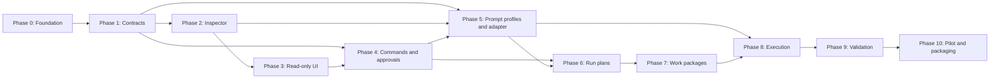

# Dashboard Phased Implementation Plan

## Document status

**Status:** `IN PROGRESS — implementation underway`

This plan implements the behavior defined in [dashboard-design.md](dashboard-design.md). It assumes the dashboard remains a thin local control surface: durable workflow facts live in the customer delivery repository, reconstructible runtime state lives under `.factory-local/`, and legal state changes are owned by the orchestration core.

## Updating phase status

Update the `Status` field beneath each phase as work progresses. Allowed values are:

- `NOT STARTED`
- `IN PROGRESS`
- `BLOCKED — <reason>`
- `COMPLETE — <date or commit>`
- `DEFERRED — <reason>`

Check a task only when its implementation and tests are complete. A phase is `COMPLETE` only when all exit criteria are satisfied or an explicitly documented exception has been approved.

## Implementation principles

- Build repository and workflow behavior behind UI-independent interfaces.
- Make repository inspection read-only; all durable writes pass through the orchestration core.
- Bind every approval, generated artifact, and execution to exact revisions and digests.
- Treat prompt-task model selection as configuration, but record the effective model, reasoning effort, adapter, and prompt mode for every invocation.
- Keep schema checks, state transitions, approval validity, dependency readiness, and diff classification deterministic.
- Use fake execution adapters for automated tests and reserve live Codex calls for explicit integration and pilot tests.
- Do not require an API key for the subscription-backed local Codex path.

## Suggested architecture

**Decision status:** `ACCEPTED — ADR-001-dashboard-stack`

### Platform

Build the dashboard as a TypeScript local web application:

- React browser UI.
- Node.js backend using Fastify.
- Vite for frontend development and production bundling.
- Node's built-in SQLite support for reconstructible `.factory-local/` state.
- Codex App Server launched and supervised as a child process using its default standard-input/standard-output JSONL protocol.
- Git command-line operations executed by constrained backend services with explicit working directories and argument arrays.

The backend binds to `127.0.0.1` by default and serves both the production frontend and dashboard API. Do not add Electron for the first release. A desktop wrapper can be considered later without changing the application or orchestration contracts.

### Runtime topology

```mermaid
flow LR
    Browser[React dashboard] -->|HTTP and server-sent events| Backend[Fastify localhost backend]
    Backend --> Inspector[Repository inspector]
    Backend --> Core[Orchestration core]
    Backend --> Runtime[Local runtime services]
    Core --> Validator[Schema validation]
    Core --> Dispatcher[Task dispatcher]
    Inspector --> Delivery[(Customer delivery repository)]
    Inspector --> Product[(Product repository)]
    Core --> Delivery
    Core --> Product
    Runtime --> SQLite[(.factory-local SQLite)]
    Dispatcher --> Adapter[Codex execution adapter]
    Adapter -->|stdio JSONL| Codex[Codex App Server]
    Codex --> Worktree[(Isolated product worktree)]
```

The browser never reads repositories, starts processes, invokes Git, or writes workflow records directly. It sends constrained requests to the backend. The backend delegates legal transitions and durable writes to the orchestration core rather than implementing workflow rules in route handlers.

### Application components

| Component            | Responsibility                                                                                                                              |
| -------------------- | ------------------------------------------------------------------------------------------------------------------------------------------- |
| React UI             | Views, filters, artifact review, approval dialogs, prompt-profile controls, execution monitoring, and diff/evidence presentation            |
| Dashboard API        | Localhost transport, request validation, actor/session context, typed response mapping, and event streaming                                 |
| Repository inspector | Read-only repository discovery, Git status, artifact indexing, digest calculation, schema results, and derived projections                  |
| Orchestration core   | Command validation, legal transitions, idempotency, approval enforcement, durable record creation, and reconciliation                       |
| Schema validator     | Versioned JSON Schema registry, format checks, compatibility checks, and path-level validation errors                                       |
| State store          | SQLite-backed leases, heartbeats, caches, process metadata, log offsets, prompt defaults, and reconnect information                         |
| Dispatcher           | Converts eligible workflow work into an execution-adapter request and records requested and actual execution settings                       |
| Codex adapter        | Starts and supervises App Server, submits standard or goal prompts, records task/thread identity, and maps Codex events into runtime events |
| Validation runner    | Executes allowlisted deterministic checks and captures structured evidence without exposing arbitrary shell execution                       |

### Suggested source layout

```text
apps/dashboard/application/
  src/
    backend/
      api/
      composition/
      config/
      events/
    frontend/
      components/
      features/
      routes/
      styles/
    shared/
      api-contracts/
      task-profiles/
  tests/
    fixtures/
    integration/
    browser/
```

Reusable workflow behavior remains in `packages/` rather than becoming dashboard-only code:

```text
packages/
  orchestration-core/
  repository-inspector/
  schema-validation/
  state-store/
  dispatcher/
  execution-adapters/
```

The exact source layout may be adjusted during scaffolding, but dependencies must point inward toward UI-independent packages. Orchestration packages must not import React, Fastify route modules, or browser code.

### Suggested third-party packages

Use the smallest practical dependency set and pin it through the checked-in lockfile.

| Area                 | Suggested packages                                      | Purpose                                                         |
| -------------------- | ------------------------------------------------------- | --------------------------------------------------------------- |
| Frontend             | `react`, `react-dom`, `react-router-dom`                | UI rendering and navigation                                     |
| Server state         | `@tanstack/react-query`                                 | API fetching, refresh, and cache invalidation                   |
| Backend              | `fastify`, `@fastify/static`                            | Local API and production asset serving                          |
| Schema and YAML      | `ajv`, `ajv-formats`, `yaml`                            | Contract and configuration validation                           |
| Document display     | `react-markdown`, `rehype-sanitize`                     | Safe rendering of Markdown plans and documentation              |
| Build and unit tests | `typescript`, `vite`, `vitest`                          | Compilation, bundling, and fast automated tests                 |
| UI tests             | `@testing-library/react`, `@testing-library/user-event` | Component behavior and accessibility-oriented interaction tests |
| Browser tests        | `playwright`                                            | End-to-end dashboard verification                               |
| Code quality         | `eslint`, `typescript-eslint`, `prettier`               | Static analysis and consistent formatting                       |

Use Node standard-library capabilities for SQLite, filesystem access, path handling, hashing, UUID generation, child processes, and server-sent events where practical. Use the installed Git executable rather than adding a native Git library. Avoid an ORM initially; the local state store is small and benefits from explicit SQL and migrations.

### Data and communication choices

- Use same-origin HTTP endpoints for commands and queries.
- Use server-sent events for one-way live execution updates; use ordinary POST requests for user actions. Add WebSockets only if a demonstrated bidirectional requirement cannot be met this way.
- Store immutable business records in the customer delivery repository through the orchestration core.
- Store only reconstructible runtime state and machine-local dashboard defaults in `.factory-local/` SQLite.
- Serve or open approved local artifacts through allowlisted backend routes; never accept an arbitrary filesystem path from the browser.
- Render Markdown in the browser after sanitization. Offer DOCX and other unsupported formats as safe open/download actions.
- Generate TypeScript types from canonical JSON Schemas or maintain one tested schema-to-type build step; do not hand-maintain conflicting browser and backend contracts.
- Use structured JSON logs with redaction and rotation in `.factory-local/`.

### Codex integration

The local backend owns the Codex App Server process and protocol connection. The browser never communicates with App Server directly.

- Run-plan generation sends one standard prompt using the configured generation profile.
- Work-package sequencing sends one standard prompt using the configured sequencing profile.
- Run-plan execution creates a goal using the configured execution profile and supplies the full approved implementation run plan.
- Discover model and reasoning capabilities from the active adapter and reject unsupported selections.
- Persist task/thread identifiers, requested settings, actual settings, prompt-template version, and reconnect metadata.
- Use a fake adapter for automated tests and require an explicit operator action for live Codex integration tests.

This path uses the locally authenticated Codex installation and does not require the dashboard to store an OpenAI API key. Keep an API-backed adapter outside the MVP unless it is separately authorized.

## Phase 0 — Application foundation and technology decisions

**Status:** `COMPLETE — 2026-09-06`

**Depends on:** None

**Objective:** Establish a runnable local application and settle the technology choices that all later phases depend on.

### Development tasks

- [x] Record an architecture decision for the UI framework, local backend, package manager, runtime versions, and test tools.
- [x] Evaluate the recommended starting stack: TypeScript, React, a small Node.js HTTP service, and SQLite for `.factory-local/` state. Record any different choice and its rationale before scaffolding.
- [x] Define the process topology: browser UI -> localhost dashboard backend -> orchestration packages -> repositories/local runtime -> Codex adapter.
- [x] Create the application source layout under `apps/dashboard/application/`, separating UI, backend/API, shared contracts, and adapter composition.
- [x] Add dependency manifests, lockfile, formatting, linting, type checking, unit-test, integration-test, and production-build commands.
- [x] Add a localhost-only development server and `/health` endpoint.
- [x] Add startup configuration for the delivery-repository path, listening port, log level, and runtime-state path.
- [x] Validate that configured repository and runtime paths are absolute or safely resolved and do not escape the intended roots.
- [x] Ensure `.factory-local/`, logs, SQLite files, task packets, and generated caches are ignored by Git.
- [x] Add structured error handling and redacted local logging.
- [x] Replace the application scaffold README with install, start, test, and build instructions.

### Tests and verification

- [x] Clean install succeeds on the supported Windows environment.
- [x] Development and production builds start and serve `/health` on localhost.
- [x] Formatting, linting, type checking, and unit tests run through one documented verification command.
- [x] Startup fails clearly for an invalid or inaccessible delivery-repository path.

### Exit criteria

- A developer can clone the repository, run the documented setup, and open an empty dashboard shell locally.
- The selected stack and process boundaries are documented and no longer implicit.

## Phase 1 — Canonical contracts and test fixtures

**Status:** `COMPLETE — 2026-09-06`

**Depends on:** Phase 0

**Objective:** Finalize the minimum versioned contracts needed by the dashboard before implementing workflow writes.

### Development tasks

- [x] Define version 1 machine-readable schemas for canonical requirement metadata, work packages, run plans, model profiles, execution results, and validation evidence.
- [x] Extend the approval schema with `system_plan` and `work_package` binding types.
- [x] Confirm how requirement, work-package, and run-plan approval gates identify their target run before the first approval is written.
- [x] Extend or version the command contract so the three prompt-task types are unambiguous: `work_package_sequencing`, `run_plan_generation`, and `run_plan_execution`.
- [x] Define the execution-selection fields for prompt mode, requested model, requested reasoning effort, adapter, fallback policy, and actual resolved settings.
- [x] Define naming, revision, sidecar, digest, and supersession rules for generated artifacts.
- [x] Define each run plan as a full, reviewable phased Markdown implementation plan bound to one requirement, plus a minimal schema-validated sidecar with stable phase/task identifiers.
- [x] Define each work package as an ordered list of one or more exact approved run-plan references, with sequence and package-level execution metadata.
- [x] Define execution progress as a separate phase/task status record so status updates do not mutate or invalidate an approved run plan.
- [x] Reconcile the system-plan schema's proposed work-package references with the approved-run-plan work-package model, including migration of the current example.
- [x] Define compatibility and migration behavior for every schema changed in this phase.
- [x] Implement the schema-validation package with format checking, useful path-level errors, and a registry of supported schema versions.
- [x] Add valid and invalid examples for every contract used by the dashboard.
- [x] Create a non-customer test delivery repository containing approved, rejected, superseded, missing, malformed, and stale-binding scenarios.

### Tests and verification

- [x] Validate every checked-in dashboard schema and positive contract example against JSON Schema Draft 2020-12.
- [x] Prove the incomplete run-plan fixture fails for its intended reason.
- [x] Add compatibility tests for old approval and command examples.
- [x] Add digest test vectors so the backend and tests calculate identical SHA-256 values.

### Exit criteria

- No later phase needs to invent an ad hoc work-package, run-plan, model-profile, command, approval, execution, or evidence format.
- Approval bindings can represent all three required gates in order: requirement, run plan, and work-package membership/sequencing.

## Phase 2 — Repository inspector and derived projections

**Status:** `COMPLETE — 2026-09-06`

**Depends on:** Phase 1

**Objective:** Build the read-only foundation that discovers configured repositories and reconstructs dashboard state.

### Development tasks

- [x] Implement `system.yaml` loading and resolution of product, orchestrator, requirements-factory, and development-factory repository paths.
- [x] Parse `delivery.lock`; allow read-only browsing when it is unresolved but emit a hard execution blocker.
- [x] Enforce safe path normalization and prevent configured artifact paths from escaping their repository root.
- [x] Implement Git inspection for repository availability, branch, HEAD revision, dirty state, remotes, and worktree metadata.
- [x] Index submissions, requirements, system plans, work packages, run plans, commands, approvals, runs, events, evidence, and releases from configured directories.
- [x] Calculate and cache artifact digests without mutating the inspected repository.
- [x] Validate indexed sidecars and expose structured validation errors.
- [x] Project approval state by exact artifact identifier, revision, path, and digest: awaiting review, approved, rejected, superseded, or invalidated.
- [x] Project system readiness and workflow state from durable artifacts and ordered workflow events.
- [x] Detect missing files, duplicate identifiers, unsupported schema versions, broken references, and approval bindings that no longer match.
- [x] Add an explicit refresh/reconcile operation.
- [x] Add an optional filesystem watcher that invalidates caches safely.
- [x] Expose the inspector through UI-independent interfaces and typed backend endpoints.

### Tests and verification

- [x] Unit-test path resolution, Git inspection, digesting, indexing, and projection logic.
- [x] Integration-test all fixture states from Phase 1.
- [x] Verify inspection performs no repository writes, including when files are malformed.
- [x] Verify restart reconstruction produces the same durable projection without relying on prior cache state.

### Exit criteria

- One backend request returns a complete, explainable snapshot of the configured delivery system.
- Every displayed approval and workflow status can be traced to source artifacts and exact bindings.

## Phase 3 — Read-only dashboard experience

**Status:** `COMPLETE — 2026-09-06`

**Depends on:** Phase 2

**Objective:** Deliver a useful read-only dashboard before enabling commands or approvals.

### Development tasks

- [x] Build the application shell and navigation for Overview, Requirements, Planning, Run Plans, Approvals, Active Runs, Validation and Release, History, and Settings.
- [x] Build System Overview with repository health, lock status, schema status, system-plan status, Codex availability placeholder, approval counts, and blockers.
- [x] Build requirement lists and filters for awaiting review, approved, rejected, invalid, and superseded revisions.
- [x] Build Planning views for the system plan, approved requirements awaiting run plans, approved run plans awaiting packaging, work packages, and run-plan sequence.
- [x] Build run-plan, approval-inbox, active-run, evidence, release-readiness, and history read views.
- [x] Add artifact details showing identifier, revision, digest, source path, validation state, relationships, and decision history.
- [x] Render Markdown, YAML, and JSON safely. Provide a safe open/download action for formats such as DOCX rather than attempting lossy browser conversion.
- [x] Add loading, empty, partial-data, stale-data, validation-error, and repository-unavailable states.
- [x] Add refresh/reconcile controls and display the snapshot timestamp.
- [x] Meet keyboard navigation, focus visibility, contrast, labeling, and screen-reader requirements for all review screens.
- [x] Add responsive layouts suitable for normal laptop and wide desktop screens.

### Tests and verification

- [x] Add component tests for lists, filters, artifact details, status labels, and error states.
- [x] Add browser tests that navigate every primary view using fixture data.
- [x] Verify untrusted repository content is escaped and cannot execute in the browser.
- [x] Verify opening an artifact cannot access a path outside the configured repository.

### Exit criteria

- A reviewer can locate every relevant artifact, understand its derived state, and open it for review without using the command line.
- The dashboard remains useful when some contracts or repositories are invalid or unavailable.

## Phase 4 — Orchestration core, commands, and approval gates

**Status:** `COMPLETE — 2026-09-06`

**Depends on:** Phases 1–3

**Objective:** Enable safe human decisions and state-guarded workflow mutations.

### Development tasks

- [x] Implement local actor configuration and capture actor identifier, display name, role, and authentication method in every decision.
- [x] Implement command validation, authorization hooks, optimistic revision checks, legal transition checks, and idempotency handling.
- [x] Implement atomic durable-record writes through the orchestration core using temporary-file replacement and repository-level locking.
- [x] Implement immutable approval and rejection creation for requirement revisions.
- [x] Implement immutable approval and rejection creation for work-package membership and sequencing.
- [x] Implement immutable approval and rejection creation for run-plan revisions.
- [x] Bind confirmation dialogs to the exact artifact identifier, revision, path, and digest displayed to the reviewer.
- [x] Require a rejection reason and keep rejected source artifacts in their original directories.
- [x] Invalidate a satisfied gate when a bound artifact changes and show the prior decision as historical.
- [x] Prevent duplicate records from double-clicks, retries, process restarts, or repeated idempotency keys.
- [x] Append accepted/rejected workflow events and refresh the derived projection after each action.
- [x] Add compare-revision and decision-history views.

### Tests and verification

- [x] Test all legal and illegal approval transitions.
- [x] Test stale revision, changed digest, unauthorized actor, malformed command, and duplicate idempotency-key failures.
- [x] Simulate interruption during a durable write and verify no partial record is accepted.
- [x] Verify agents and generated prompts cannot approve their own artifacts.
- [x] Browser-test an exact run-plan rejection with the reviewed revision and digest.
- [x] Browser-test approve, revise, supersede, and invalidate flows for all three gates.

### Exit criteria

- Reviewers can complete all three required approval gates from the dashboard.
- Every mutation is attributable, immutable, schema-valid, idempotent, and reconstructible after restart.

## Phase 5 — Prompt profiles and Codex adapter boundary

**Status:** `COMPLETE — 2026-09-06`

**Depends on:** Phases 1, 2, and 4

**Objective:** Configure and safely invoke the three prompt-based task types without coupling workflow logic to one executor.

### Development tasks

- [x] Implement a task-profile registry for `work_package_sequencing`, `run_plan_generation`, and `run_plan_execution`.
- [x] Store machine-local default profiles in `.factory-local/`; do not store credentials there or in Git.
- [x] Seed the agreed defaults: run-plan generation uses `gpt-5.6-sol`; run-plan execution uses `gpt-5.6-luna` with `high` reasoning. Leave unapproved defaults visibly unset.
- [x] Build Settings controls for model and reasoning effort per task type.
- [x] Build per-invocation confirmation controls that display and permit an override of the effective model and reasoning effort.
- [x] Query the active execution adapter for available models and supported reasoning levels.
- [x] Reject unsupported combinations and unavailable models; never substitute a fallback unless the operator explicitly selected an allowed fallback policy.
- [x] Fix prompt mode by task type: standard prompt for planning and run-plan generation, goal prompt for run-plan execution.
- [x] Define and version prompt templates for each task type, reusing the existing portfolio/batch planning instructions where appropriate.
- [x] Implement prompt assembly with exact artifact references, digests, relevant system context, output contract, and write boundaries.
- [x] Add prompt preview with secret and customer-sensitive-data redaction checks.
- [x] Define a generic execution-adapter interface and implement a deterministic fake adapter for tests.
- [x] Implement Codex App Server capability/authentication health reporting or a clearly isolated spike if the required integration endpoint is not yet stable.
- [x] Record requested and actual model, reasoning, adapter, prompt mode, prompt-template version, task/thread identifier, and outcome.

### Tests and verification

- [x] Unit-test effective-profile resolution, overrides, capability filtering, and no-fallback behavior.
- [x] Snapshot-test prompt packets without embedding customer secrets or full protected evidence.
- [x] Contract-test the fake adapter for success, validation failure, timeout, cancellation, and blocked/user-input states.
- [x] Verify a profile change does not alter the historical execution settings recorded for prior tasks.

### Exit criteria

- All three task types have explicit, reviewable model parameters and fixed prompt modes.
- Later phases can invoke either the fake or Codex adapter through the same tested interface.

## Phase 6 — Run-plan generation and approval

**Status:** `COMPLETE — 2026-09-06`

**Depends on:** Phases 4 and 5

**Objective:** Generate a full phased implementation run plan from one approved requirement using a single standard prompt.

### Development tasks

- [x] Permit generation only for one exact approved requirement revision whose binding remains valid.
- [x] Assemble the requirement, relevant system-plan context, product baseline, development-factory contract, architecture, installed modules, and existing customization context.
- [x] Submit one standard prompt using the effective run-plan generation profile; do not create a goal or long-running goal lifecycle.
- [x] Require one complete human-readable Markdown implementation plan with phases, specific development tasks, verification, exit criteria, stable phase/task identifiers, and initial status fields.
- [x] Define the minimal structured sidecar needed to bind the plan to its requirement and index stable phase/task identifiers.
- [x] Parse and validate the draft plan and sidecar against the active run-plan contract.
- [x] Show model-output and validation errors without saving an invalid canonical plan.
- [x] Save each valid regeneration as a new immutable run-plan revision through the orchestration core.
- [x] Display the full plan rather than reducing the agent's working context to the structured index.
- [x] Add side-by-side or structured revision comparison.
- [x] Route the exact run-plan revision through approval or rejection.
- [x] Ensure a revision request reruns the run-plan generation task profile rather than creating a fourth profile.

### Tests and verification

- [x] Test missing requirement approval, changed requirement, missing system context, unresolved product baseline, invalid output, timeout, and regeneration.
- [x] Prove one invocation produces at most one canonical draft revision.
- [x] Verify no goal record is created during run-plan generation.
- [x] Verify every phase and task has a stable identifier and initial status.
- [x] Browser-test generate, validate, and inspect the full plan.
- [x] Browser-test compare, approve, reject, and regenerate flows.

### Exit criteria

- A reviewer can generate and approve a complete phased implementation plan from one approved requirement without manually assembling a prompt.
- The approved plan is bound to the exact requirement, system-plan context, baseline, and effective prompt profile.

## Phase 7 — Work-package assembly and sequencing

**Status:** `COMPLETE — 2026-09-06`

**Depends on:** Phase 6

**Objective:** Group one or more approved run plans into a work package and approve their implementation sequence.

### Development tasks

- [x] Allow selection only of exact, currently approved run-plan revisions.
- [x] Create a work-package record containing at least one run-plan identifier, revision, path, digest, and explicit sequence number.
- [x] Gather each run plan's requirement dependencies, affected Odoo modules, path overlap, database concerns, conflicts, and product baseline.
- [x] Assemble package membership from the exact approved run plans selected by the operator.
- [x] Invoke one standard work-package sequencing prompt that proposes only their execution order and rationale.
- [x] Validate the response against the work-package contract before it is saved or displayed as reviewable output.
- [x] Persist a new immutable work-package revision through the orchestration core.
- [x] Display ordered run-plan cards with source requirement, sequence, derived execution status, current phase/task, and links to the full plans.
- [x] Display a dependency graph with ordering rationale and conflicts.
- [x] Allow constrained human edits to membership and sequence by creating a new revision, never by changing an approved package in place.
- [x] Support a one-run-plan package with sequence `1` without artificial dependencies.
- [x] Route the exact proposed revision through the work-package membership/sequencing approval gate.
- [x] Re-run the same work-package sequencing profile when a new order is requested.

### Tests and verification

- [x] Test zero selection, unapproved or changed run plan, duplicate sequence, duplicate membership, sequence gaps, dependency inversion, cyclic dependency, and inconsistent baseline failures.
- [x] Test deterministic parsing and schema validation of model output.
- [x] Test one-plan and multi-plan packages.
- [x] Browser-test assembly, sequence suggestion, and full-plan navigation.
- [x] Browser-test package revision, approval, and rejection flows.

### Exit criteria

- An operator can turn approved run plans into a schema-valid, human-approved work package and explicit sequence.
- The package binds every included run-plan revision and digest and records the effective sequencing profile.

## Phase 8 — Preflight and goal-driven implementation execution

**Status:** `COMPLETE — 2026-09-06`

**Depends on:** Phases 5 and 7

**Objective:** Execute every run plan in an approved work package, in sequence, through goal-driven Codex tasks.

### Development tasks

- [x] Implement all preflight checks from the dashboard design: schema validity, approvals, dependencies, commits, branches, dirty worktrees, path rules, model availability, adapter health, and run ownership.
- [x] Present every failure as a structured blocker with permitted recovery actions.
- [x] Implement `.factory-local/` runtime persistence for leases, heartbeats, task identity, process state, logs, offsets, and reconnect metadata.
- [x] Acquire a single-orchestrator lease before creating execution side effects.
- [x] Resolve the exact product base commit and create an isolated worktree and legal task branch.
- [x] Build each implementation task packet with the full approved run plan, exact inputs, allowed and forbidden paths, validation criteria, and stop conditions.
- [x] Start the Codex task with the effective execution model and reasoning settings; default to `gpt-5.6-luna` with `high` reasoning.
- [x] Submit the full approved run plan as a goal prompt and keep it active across implementation turns until that plan is completed or blocked.
- [x] Record the returned Codex task/thread identifier and actual execution settings.
- [x] Stream or poll execution events into the local projection without committing high-frequency telemetry.
- [x] Record phase and task progress in a separate execution record keyed by the stable identifiers in the approved plan.
- [x] Do not edit status fields in the approved run-plan document; display the execution progress overlay alongside the full plan.
- [x] Display active run plan, phase, task, elapsed time, current state, logs, requests for input or permission, and changed-file summary.
- [x] Prevent sequence `n + 1` from starting until sequence `n` has completed validation and been accepted.
- [x] Implement state-guarded pause, resume, and cancel commands.
- [x] Implement retry and request-replan commands with reviewed replacement inputs.
- [x] Preserve the selected execution profile on resume/retry; changed-profile replacement remains approval-gated by the new run.
- [x] Implement restart reconciliation and reconnection-to-review handling for a known Codex task.
- [x] Retain a manual task-packet fallback that follows the same contracts and records the manually created task identifier.

### Tests and verification

- [x] Unit-test every preflight check and blocker recovery path.
- [x] Integration-test lease contention, worktree creation, task dispatch, reconnect, cancellation, and crash recovery with the fake adapter.
- [x] Verify no implementation task can write to the delivery, orchestrator, requirements-factory, or development-factory inputs.
- [x] Run an explicitly authorized live Codex smoke test with a disposable no-op worktree.
- [x] Verify the live task receives a full approved run-plan payload as a goal prompt and records Luna/high as requested and actual settings when available.
- [x] Verify multi-plan packages execute serially in exact approved sequence and stop when a plan is blocked or fails.
- [x] Verify progress updates do not change or invalidate the approved run-plan digest.

### Exit criteria

- An approved work package can be started and each included run plan followed through completion, blocking, or cancellation in sequence.
- A dashboard restart does not lose durable workflow state or the ability to identify the active Codex task.

## Phase 9 — Diff boundaries, validation, evidence, and result disposition

**Status:** `COMPLETE — 2026-09-06`

**Depends on:** Phase 8

**Objective:** Decide whether implementation output is acceptable based on the complete product diff and declared quality gates.

### Development tasks

- [x] Compare the complete isolated worktree state to the recorded base commit after execution.
- [x] Include committed changes, uncommitted changes, untracked files, deletions, renames, mode changes, and submodule pointer changes.
- [x] Classify every changed path as allowed, unexpected, or forbidden using the run-plan boundaries.
- [x] Block automatic acceptance when unexpected or forbidden changes exist.
- [x] Display a path summary and full diff before the operator records an exception disposition, failure, or replanning request.
- [x] Keep conditional diff review separate from the three normal approval gates while preserving an attributable immutable disposition when an exception is accepted.
- [x] Execute declared lint, test, build, Odoo module-install/upgrade, and targeted validation gates through constrained deterministic runners. Product-specific Odoo runners are declared in `factory.yaml`; unconfigured gates remain explicitly skipped/partial until deployment configuration is supplied.
- [x] Capture exit status, tool versions, timestamps, logs, and artifact references in a schema-valid evidence manifest.
- [x] Validate requirement acceptance-criteria traceability against implementation and test evidence.
- [x] Accept an implementation result only when a passed evidence manifest exists and the human records an attributable disposition.
- [x] Display result summary, failed checks, evidence, resulting commit, remaining risks, and available recovery actions.
- [x] Build release-readiness and history projections from accepted immutable records.

### Tests and verification

- [x] Test all diff classifications, including rename and delete edge cases.
- [x] Test failed, skipped, timed-out, and partially produced validation evidence.
- [x] Verify an agent-reported success cannot bypass deterministic result acceptance.
- [x] Browser-test diff review, validation results, evidence recording, and accepted-result paths.
- [x] Browser-test failure, exception, replanning, and evidence navigation paths.

### Exit criteria

- The dashboard can prove what changed, whether it stayed within scope, which gates ran, and why the result was accepted or blocked.
- Accepted results and evidence reconstruct correctly after restart.

## Phase 10 — Context-menu pilot, hardening, and packaging

**Status:** `BLOCKED — hardening, performance, runtime-reconstruction, and operational verification complete; the context-menu pilot and final acceptance require a resolved delivery lock, a valid system-plan artifact, and operator approval inputs`

**Depends on:** Phases 0–9

**Objective:** Validate the complete MVP with the first Odoo context-menu requirement and make the dashboard operable by another developer.

### Development tasks

- [ ] Prepare schema-valid sidecars and exact digests for the context-menu requirement and its system-plan context.
- [ ] Run the complete path: requirement approval -> full run-plan generation -> run-plan approval -> work-package assembly/order -> work-package approval -> preflight -> Luna/high goal execution -> progress tracking -> diff review -> validation -> result disposition.
- [ ] Record every defect and workflow ambiguity found during the pilot; resolve release-blocking issues and explicitly defer the rest.
- [x] Add end-to-end tests for the successful pilot path and the highest-risk blocked/rejected paths.
- [x] Perform path traversal, command injection, unsafe document rendering, secret leakage, CSRF/local-origin, and arbitrary-shell-execution reviews.
- [x] Test large logs, large diffs, malformed repositories, App Server disconnection, process crashes, stale leases, and abrupt machine restart.
- [x] Measure and improve startup, indexing, refresh, and primary-view response times on a representative delivery repository. Current local baseline: 606 ms cold start to `/api/health`; 30 `/api/snapshot` requests averaged 200 ms (p95 217 ms, maximum 314 ms) on 2026-09-06.
- [x] Add installation, upgrade, backup/recovery, troubleshooting, and uninstall documentation.
- [x] Package the local application with pinned dependencies and a documented update process.
- [x] Add a release checklist mapped to the MVP acceptance criteria in the dashboard design.
- [ ] Obtain final human acceptance of the context-menu pilot and dashboard MVP.

### Tests and verification

- [ ] All lint, type, unit, contract, integration, browser, and end-to-end suites pass from a clean checkout.
- [ ] The pilot can be repeated without manual repository repair or hidden state.
- [ ] A second developer can install and operate the dashboard from the documentation alone.
- [x] Durable state remains valid when `.factory-local/` is deleted and reconstructed.

The hardening checks exercise large output and full-diff retention, malformed
fixture repositories, lease contention, cancelled and failed tasks, process
termination/restart reconciliation, stale task recovery, and a disposable live
Codex App Server goal. The performance baseline above was measured against the
configured local customer delivery repository without changing its durable
records.

### Exit criteria

- The context-menu customization completes through the governed dashboard workflow.
- The dashboard is packaged, documented, recoverable, and accepted as the first usable local release.

## Phase dependency summary



## MVP completion rule

The dashboard MVP is complete only when Phases 0–10 are marked `COMPLETE` and the context-menu pilot demonstrates the three human approval gates and three configurable prompt-task profiles end to end. A phase may be deferred only if its absence does not break that pilot and the deferral reason is recorded in its status field.

## Implementation checkpoint — 2026-09-06

The first implementation slice is runnable under `apps/dashboard/application/`. It includes the React/Fastify shell, repository indexing and exact SHA-256 artifact bindings, versioned contract schemas and AJV registry, safe Markdown/binary artifact access, prompt-profile persistence with adapter selection, standard/goal prompt packet assembly with approval enforcement, a fake adapter, a Codex App Server stdio adapter boundary, guarded prompt-task dispatch with requested/actual settings recording, pending approval projection, planning queues, workflow-event and evidence history projections, validated canonical run-plan output persistence with immutable regeneration revisions, structured artifact comparison, immutable work-package revisions, sequencing task dispatch with deterministic fallback ordering and proposal validation, schema-validated command handling, preflight blockers, local run controls, isolated product worktree creation with legal task branches, goal dispatch with task identity recording, task-event polling and guarded serial continuation, separate schema-validated execution progress overlays, deterministic isolated-worktree Git diff classification, validation evidence and result-disposition manifests, release-readiness projections, unit/integration tests, and a Playwright browser journey.

The current configured customer delivery repository intentionally reports two execution blockers: `delivery.lock` is still `unresolved`, and no system-plan artifact exists under `customer-odoo-delivery/system-plans/`. Those are repository/workflow inputs, not dashboard code defects. The implementation must not start a governed live run until the lock is resolved and the system plan is present and valid. Phases 0–9 are complete; Phase 10 is in progress for the customer pilot and final acceptance. The implementation has completed the isolated-worktree boundary, active App Server task polling, guarded multi-plan continuation, artifact comparison, work-package revisioning, dependency analysis and graph presentation, sequencing proposal validation including cycle detection, isolated-worktree diff review, repository write locking, symlink-safe artifact access, path-boundary conflict preflight checks, queryable structured preflight checks before start, progress-overlay digest protection, configured-repository read-only execution roots with the linked product `.git` metadata exception needed for task-branch commits, named allowlisted quality gates with product-declared requirements and explicit skipped/unconfigured outcomes, product-declared no-shell quality-gate runners, path-safe evidence-manifest navigation, evidence-manifest UI, acceptance-traceability schema and exact-binding validation UI, capability-backed profile settings with no-fallback resolution, system-context/product-baseline prompt gating, validated task-output application for run-plan generation and sequencing, full approved-plan goal-prompt assembly coverage, redacted prompt-packet snapshot coverage, explicit failed/partial evidence outcome coverage, degraded-data states, responsive navigation, all three approval-gate browser decision coverage, failure/exception/replanning evidence browser coverage, cancellation and restart-reconciliation HTTP coverage, execution-boundary audit evidence, disposable HTTP workflow coverage through the real server boundary, live local Codex App Server Luna/high smoke coverage, hardening and performance baselines, runtime reconstruction after `.factory-local/` deletion, and release operations documentation. The verification command passes 30 unit/integration tests and the browser suite passes 16 journeys, including keyboard focus, accessible status-name, run-plan comparison/approval/rejection/regeneration, requirement approval, work-package revision/approval/rejection, cancellation, restart reconciliation, acceptance traceability, and blocked-result recovery coverage. Remaining unchecked items are intentionally preserved in the Phase 10 checklist because they require customer delivery inputs or final human acceptance.
