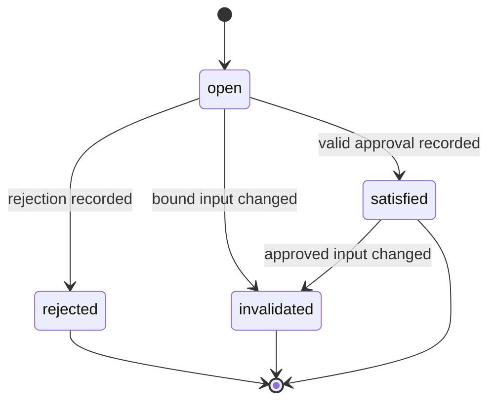

# Approval Contract

## Purpose

An approval record captures a human decision about an exact gate and exact immutable inputs. Approval is a durable business record, not a mutable status field.

The canonical machine-readable contract is `schemas/approvals/approval.schema.json`.

## Approval lifecycle

An invalidated or rejected gate is resolved by opening a new gate with a new identifier or revision. Existing approval records are never edited.

## Required approval contents

- Approval identifier, decision, gate identifier, and run target.
- Human actor identity, asserted role, authentication method, and timestamp.
- Cryptographic digest bindings for every document, sidecar, commit, evidence manifest, or release candidate covered by the decision. Files use SHA-256; Git commits use their native Git object identifier.
- Optional expiration, comments, and a reference to a superseded decision.

## Validity rules

An approval is valid only when:

1. The gate is currently open.
2. The actor is authorized for the required approval role.
3. The approval targets the correct run and gate.
4. All required bindings are present.
5. Every bound identifier, revision, and cryptographic digest still matches.
6. The record has not expired.
7. No later invalidation or superseding decision applies.

Automated test success is validation evidence, not human approval. Agents cannot approve their own plans, code, test exceptions, or releases.

## Initial human gates

| Gate | Bound inputs |
|---|---|
| `requirement_acceptance` | Requirement document and requirement sidecar. |
| `run_plan_approval` | Requirement revision, human-readable run plan, and run-plan sidecar. |
| `implementation_acceptance` | Product commit, implementation evidence, and requirement acceptance criteria. |
| `qa_release_approval` | Release candidate, test evidence, database rehearsal, exceptions, and release manifest. |

The dashboard may collect the decision, but the orchestration core validates and records it.
