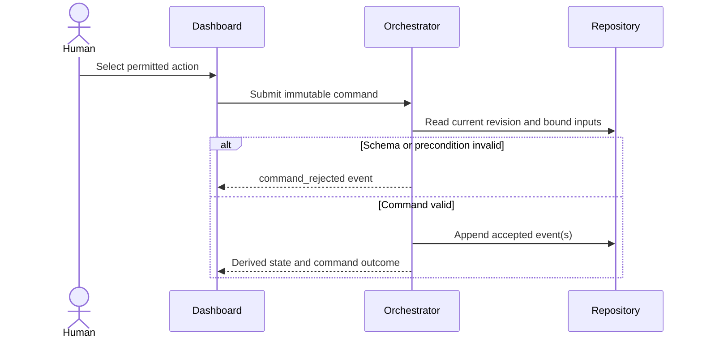

# Command Contract

## Purpose

A command records requested intent. It does not prove that a state change occurred. The orchestrator validates the command and records either a rejection event or the accepted workflow events.

Commands are immutable, uniquely identified, attributable, idempotent, and guarded by optimistic-concurrency preconditions.

The canonical machine-readable contract is `schemas/commands/command.schema.json`.

## Version 1 commands

| Command | Purpose |
|---|---|
| `start_run` | Begin preflight for an immutable requirement and run-plan revision. |
| `start_task` | Dispatch one ready task using a declared execution adapter and model selection. |
| `pause_run` | Request a reversible operational pause. |
| `resume_run` | Resume the saved state after rechecking preconditions. |
| `cancel_run` | Intentionally terminate a nonterminal run. |
| `retry_task` | Return a recoverably blocked task to readiness. |
| `submit_manual_result` | Attach the outcome of a manually operated task for validation. |
| `request_replan` | Block further implementation and request a revised plan. |

Approval is not represented by modifying a command. It uses the separate approval contract.

## Command processing

## Required envelope

Every command contains:

- Schema version and command identifier.
- Command type and idempotency key.
- Issuing actor, source, and timestamp.
- System, run, and optional task target.
- Expected run revision and expected state.
- Type-specific payload.
- Optional explanatory note, never credentials or secrets.

## Acceptance rules

The orchestrator accepts a command only when:

1. It conforms to the active schema version.
2. The actor is authorized for the command and target.
3. The target exists and is not terminal unless the command explicitly permits it.
4. Expected revision and state match the derived current state.
5. The transition is legal from that state.
6. Required bound artifacts still match their recorded hashes.
7. No other orchestrator owns the run lease.
8. Replaying the idempotency key cannot produce a second side effect.

Commands must not embed secrets, document bodies, model credentials, database dumps, or large logs.
