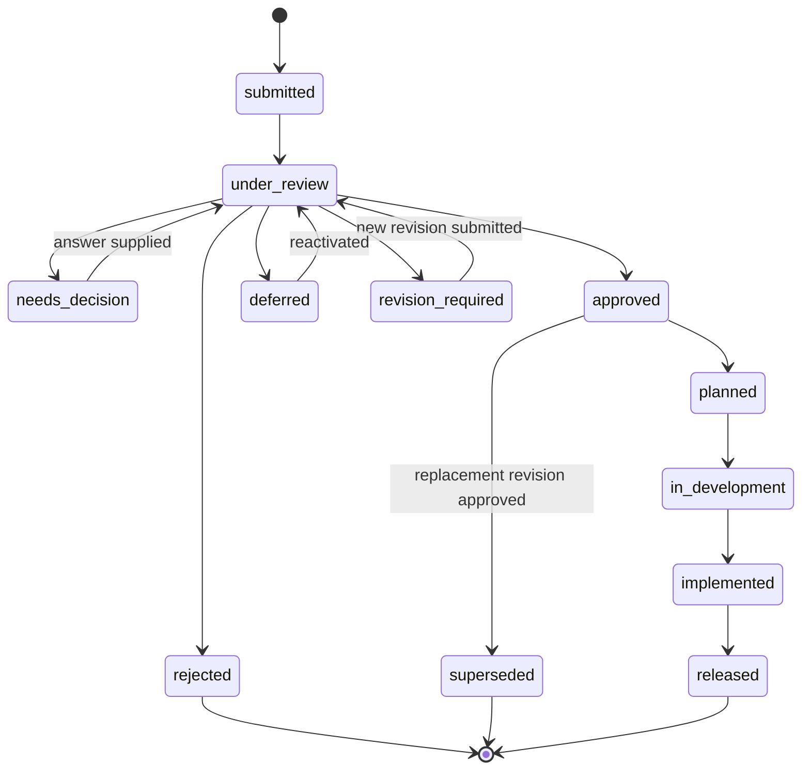

# Requirement Lifecycle

Requirement state applies to an immutable revision. Modification creates a new revision and may invalidate system plans, work packages, run plans, or approvals bound to the superseded revision.

Deferral is distinct from rejection and records a review date, release, or explicit reactivation condition.
