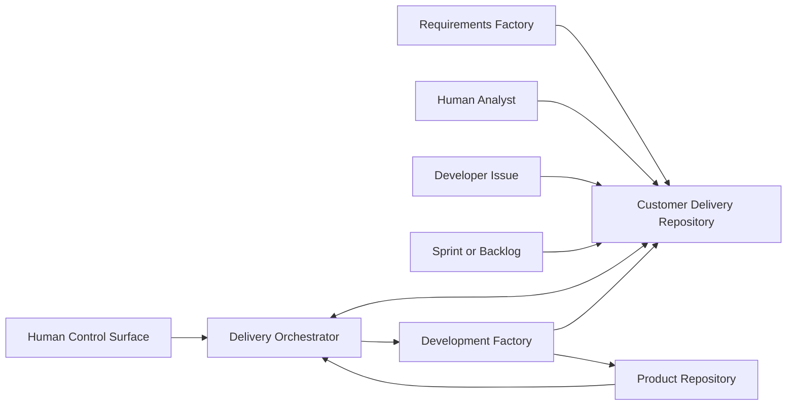

# System Context

Every source is normalized into the same canonical requirement contract. The development factory receives approved work packages and is independent of the original requirement source.
