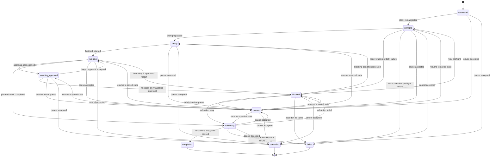
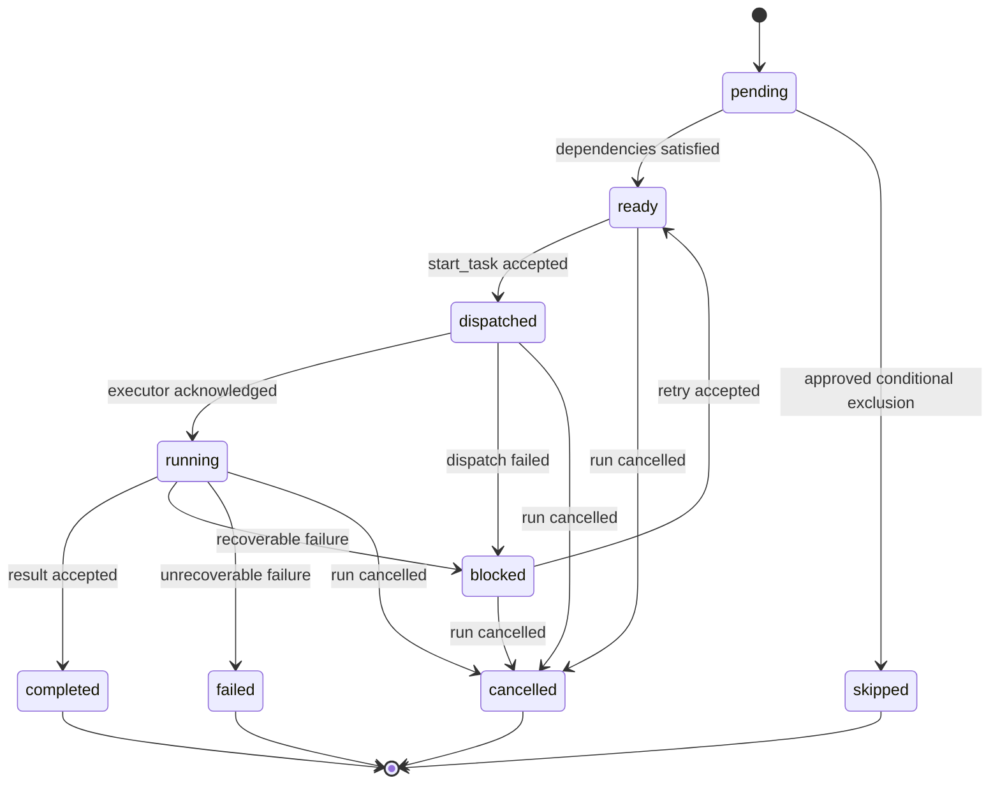

# Workflow State Machine

## Purpose

The factory uses one state-machine contract for requirement intake, implementation, validation, and release runs. A run declares its `kind`; the same lifecycle and control rules apply to every kind.

The orchestrator is the only component authorized to change run or task state. Commands and approvals are immutable facts. State snapshots are derived projections that may be rebuilt from ordered workflow events.

## Run kinds

- `requirement_intake` — review a submitted requirement, create sidecars and a human-readable run plan, and stop for approval.
- `implementation` — implement an approved plan in an isolated product worktree.
- `validation` — perform broader testing against a declared product revision and database lineage.
- `release` — assemble and approve an exact release candidate.

## Run lifecycle

## Run-state definitions

| State | Meaning | Work permitted |
|---|---|---|
| `requested` | An immutable run request exists but has not passed preflight. | Preflight only. |
| `preflight` | Inputs, hashes, repositories, models, policies, dependencies, and environment prerequisites are being checked. | Preflight checks only. |
| `ready` | Preflight passed and the next task may be dispatched. | An authorized start-task command. |
| `running` | At least one planned task is actively executing or eligible to execute. | Only tasks allowed by the dependency graph. |
| `awaiting_approval` | A human approval gate is open. | Read, review, and approval-record creation only. No downstream task may start. |
| `validating` | Planned work finished and required validators are running. | Declared validation tasks only. |
| `paused` | An authorized operational pause is active. | Inspection and cancellation only, until resumed. |
| `blocked` | The run cannot progress without a corrective action, retry, replan, or resolved dependency. | Corrective commands explicitly allowed by the blocker. |
| `completed` | All required tasks, validations, and approvals succeeded. | None; terminal and immutable. |
| `failed` | The run ended unsuccessfully and will not be resumed. | None; a replacement run may supersede it. |
| `cancelled` | An authorized actor intentionally terminated the run. | None; a replacement run may supersede it. |

## Task lifecycle

Manual Codex work uses the same task lifecycle. `dispatched` means the task packet is ready for an operator; `running` begins when the operator records the created Codex task identifier.

## Transition rules

1. Every accepted transition increments the run revision exactly once.
2. A command must state its expected run revision and expected state. A mismatch rejects the command without side effects.
3. Repeating a command with the same idempotency key returns the original outcome.
4. Terminal runs and terminal tasks are immutable.
5. A paused run records its prior resumable state; resume returns only to that state after preconditions are rechecked.
6. A blocked run records a structured blocker and the commands allowed to resolve it.
7. An approval opens for exact input digests. Changed bound inputs invalidate the gate automatically.
8. Rejection never mutates an existing approval. It creates a new immutable record and moves the run to `blocked` with a replan or revision requirement.
9. Agents may report outcomes but cannot declare their own task result accepted or advance the workflow.
10. Heartbeats, leases, log offsets, and percentages are runtime telemetry, not workflow transitions.

## Authoritative records

The current state is derived in this order:

1. Immutable run request.
2. Ordered accepted workflow events.
3. Immutable approval records referenced by gate events.
4. Accepted task-result and validation manifests referenced by events.

`state.yaml` or a local database row may cache the derived state, but neither overrides the event history.
